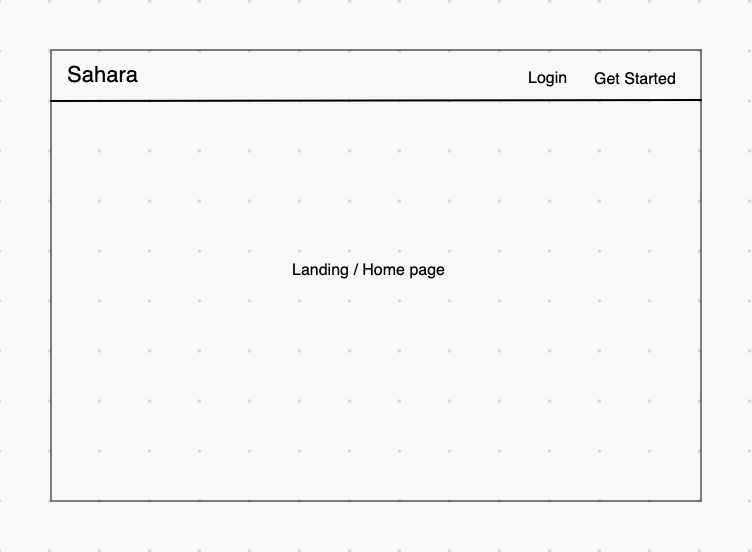
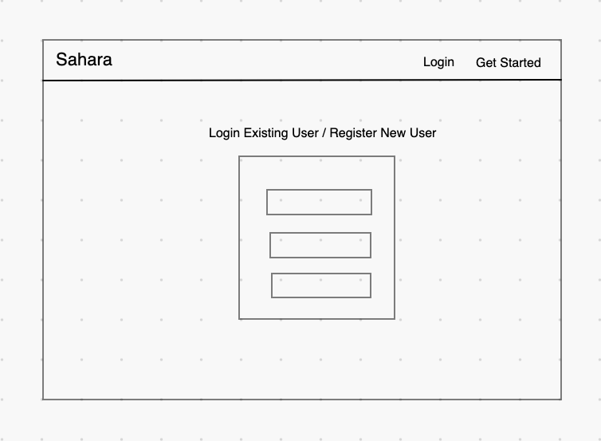
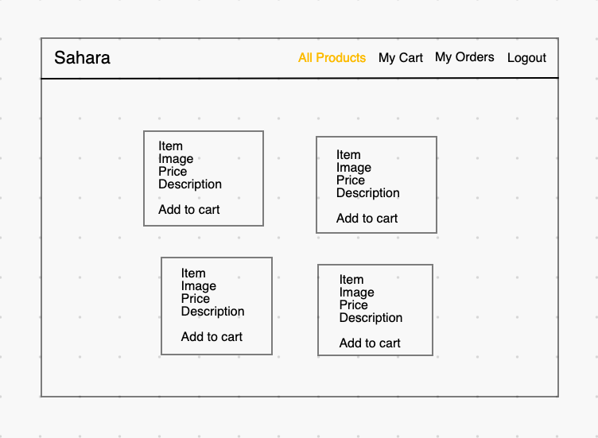
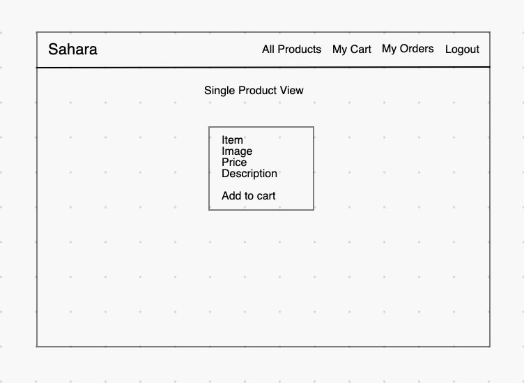
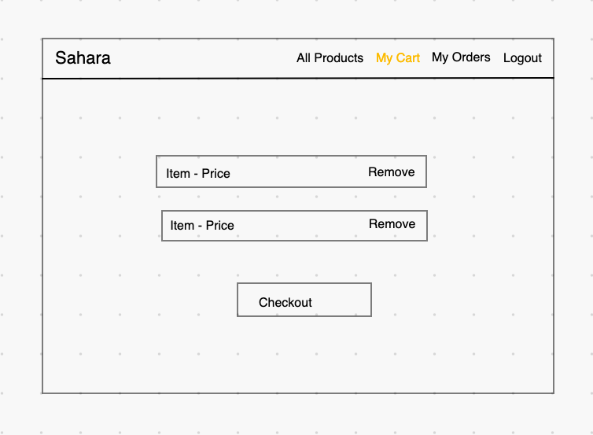
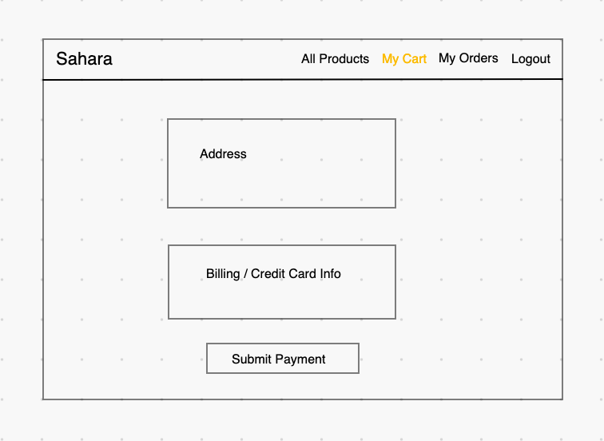
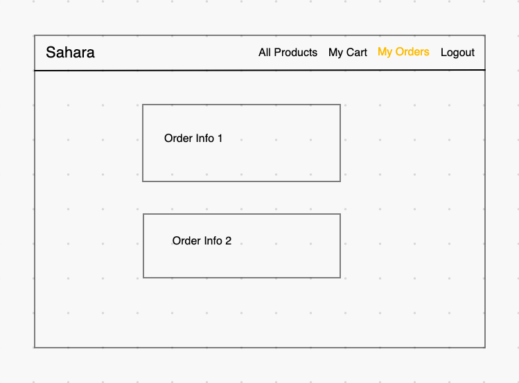

# backend-sei-group-project-3 aka Sahara
## Deployed Link
**TBD**

## Overview
Sahara is the premier e-commerce experience for finding the latest in computer accessories.

## Wireframes
#### Homepage

#### Login / Signup

#### All Products

#### Single Product

#### Shopping Cart

#### Submit Payment

#### All Orders

## Entity Relationship Diagram (ERD)

## User Stories
1. When I first visit the site, I'm on a home page that just has a simple welcome message.
1. When not logged in, I see links to home, signup & login only. If I were to visit any of these routes manually while logged in, I would get redirected to the home page.
1. I can create an account, log in, and log out. The stretch goals from https://github.com/SEI-ATL-3-8/auth-replay are all implemented.
1. When logged in, I see links to home, logout, All Products, My Cart, and My Orders. If I were to visit any of these routes manually while logged out, I would get redirected to the home page.
1. The All Products page lists the names of all available products. Clicking on any product name takes me to its details page, which include a name, description, image, and price. The products are pre-seeded in the db. In the Product Details page is an Add To Cart button, which saves the product in my cart. If I want to buy more than 1 of a product in an order, I can add it to my cart multiple times, and each one is displayed as a distinct product. (There's no way to buy in bulk.)
1. The My Cart page lists products that I have put into my cart. Next to each product is a Remove From Cart button, which removes the item from my cart (the item should disappear from the page without requiring a page refresh). The total of my order is displayed on the page (we're ignoring tax and shipping). There is a Checkout button which creates an order containing all the items from my cart, then empties the cart. In order to checkout, the shopper must input an address and a credit card number. These values will get saved to the order, but we won't do anything with them in this project. After checking out, the user is redirected to the My Orders page.
1. The My Orders page displays a list of my completed orders, using the date of the order as a clickable link. When I click on a single order, I see the Single Order page, which shows its products (name and price), the total price of the order, and the credit card & address.

## Routes
| Request   | Route URL  | Description  | Takes In  | Returns
| --------- | --------- | ------------- | ---------- | --------- |
|   POST    | /user    | user signup   | name, email, password | new user, encrypted id
|   POST    | /user/login | user login | email, password | user, encrypted id
|   GET     | /user/verify | verify user | auth id | user, encrypted id
|   GET     | /user/profile | user profile | auth id | user
|   PUT     | /user/profile | user update | auth id, name, email | updated user
|   GET     | /cart | get user's cart items | auth id | user's cart items
|   POST     | /cart | add item to cart | auth id, product id | added item
|   DELETE     | /cart | remove item from cart | auth id, cart item created at | success message
|   GET     | /products | get all products | auth id | all products
|   GET     | /products/:id | get one product | auth id, project id | one product
|   POST     | /orders | make new order | auth id, address, card | new order
|   GET     | /orders | user's orders | auth id | user's orders
|   GET     | /orders/:id | one order | auth id, order id | one order
|   POST     | /orders/:id | update order | auth id, order id | updated order
    
## MVP Goals
1. [x] User signup, login, auth
1. [x] Able to view all products
1. [x] Able to view single product details
1. [x] Able to add/remove items to/from cart and view current cart items
1. [ ] Able to submit an order of products and view all past orders
1. [ ] Able to view single order details

## Stretch Goals
1. [ ] Each Product has a quantity in the database. When a user buys a product, its quantity is reduced. Products with a quantity of 0 are not displayed in the All Products page. (A user can still only buy 1 of a product at a time.)
1. [ ] The app has one (or more) designated admin users. When an admin user logs in, they do not see the All Products, My Cart, and My Orders links. Instead, they see Manage Products and Orders To Fill.
1. [ ] Manage Products MVP: The admin user sees a list of all products, and next to each one is an input to adjust the quantity of that product.
1. [ ] Orders To Fill MVP: The admin user sees a list of all orders (from all users), which initially are in a Pending state. For each order, the admin user can click a button to convert it from Pending to Shipped. Shipped orders don't have a button, just a text or icon indicator that they've been shipped.
1. [ ] Manage Products stretch: The admin user can add new products, and edit or delete existing ones.

